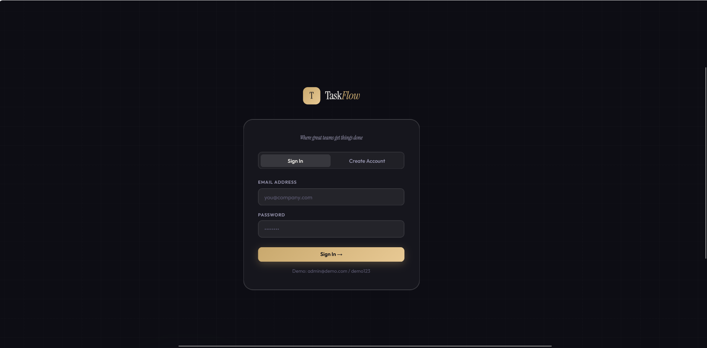
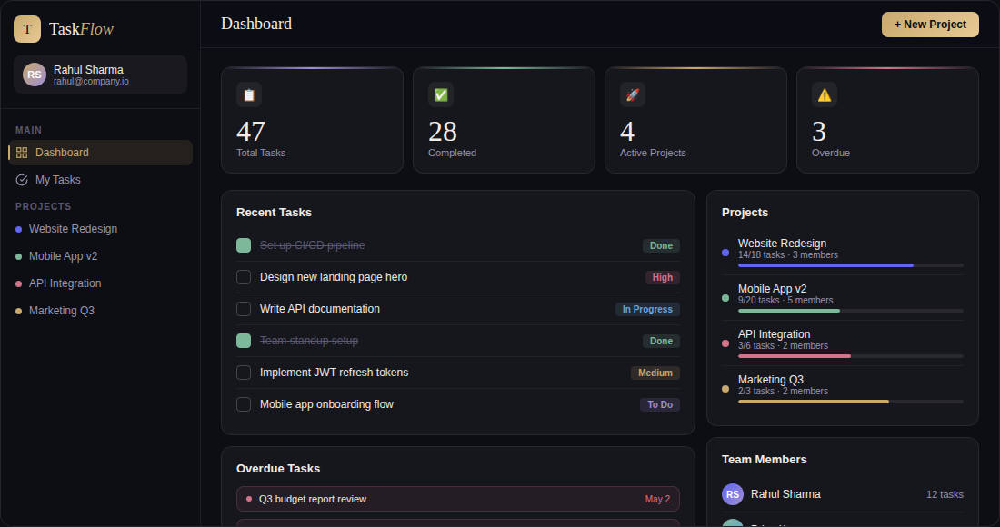

<div align="center">


# TaskFlow
### Team Command Center

**A full-stack team task management app with role-based access, project collaboration, and a live dashboard.**

[](https://nodejs.org)
[](https://expressjs.com)
[](https://sql.js.org)
[](https://jwt.io)
[](https://railway.app)
[](LICENSE)

[🚀 Live Demo](#deploying-to-railway) · [📖 API Docs](#-api-reference) · [🐛 Report Bug](https://github.com/pinkidagar18/TaskFlow/issues)

</div>

---

## 📸 Preview

<div align="center">

### 🔐 Login Page


<br/>

### 📊 Dashboard


</div>

---

## ✨ Features

| Feature | Description |
|---|---|
| 🔐 **Authentication** | Secure JWT-based signup & login with bcrypt password hashing |
| 📁 **Projects** | Create color-coded projects, invite members by email, manage roles |
| 👑 **Role-Based Access** | Admins create/edit/delete tasks; Members update only their own status |
| ✅ **Task Management** | Tasks with title, description, priority, due date & assignee |
| 📊 **Live Dashboard** | Real-time stats: total tasks, completed, active projects, overdue |
| ⚠️ **Overdue Detection** | Auto-flags tasks past due date that aren't marked done |
| 🎨 **Responsive UI** | Dark glass-morphism design — vanilla HTML/CSS/JS, no framework needed |

---

## 🛠️ Tech Stack

```
Frontend   →  HTML · CSS · Vanilla JavaScript (SPA)
Backend    →  Node.js · Express.js
Database   →  SQLite via sql.js (file-based, zero config)
Auth       →  JWT (jsonwebtoken) · bcryptjs
Dev Tool   →  Nodemon (hot reload)
Deploy     →  Railway (railway.json included)
```

---

## 📁 Project Structure

```
TaskFlow/
├── 📂 frontend/
│   └── index.html              # Single-page frontend app
├── 📂 backend/
│   ├── server.js               # Express entry point
│   ├── 📂 db/
│   │   ├── database.js         # sql.js init & helper layer
│   │   └── taskflow.db         # SQLite database file
│   ├── 📂 middleware/
│   │   └── auth.js             # JWT authentication middleware
│   └── 📂 routes/
│       ├── auth.js             # /api/auth
│       ├── projects.js         # /api/projects
│       ├── tasks.js            # /api/tasks
│       └── dashboard.js        # /api/dashboard
├── 📂 images/
│   ├── taskflow.png            # Dashboard screenshot
│   └── login_page.png          # Login page screenshot
├── .env.example
├── package.json
└── railway.json
```

---

## 🚀 Getting Started

### Prerequisites

- **Node.js** v18+
- **npm**

### 1. Clone the repository

```bash
git clone https://github.com/pinkidagar18/TaskFlow.git
cd TaskFlow
```

### 2. Install dependencies

```bash
cd backend
npm install
```

### 3. Configure environment variables

```bash
cp .env.example backend/.env
```

Edit `backend/.env`:

```env
JWT_SECRET=your_super_secret_jwt_key_change_this_in_production
PORT=5000
DB_PATH=./backend/db/taskflow.db
```

### 4. Start the dev server

```bash
npm run dev
```

> 🟢 App live at **http://localhost:5000**

---

## 🔑 API Reference

<details>
<summary><b>🔐 Auth — <code>/api/auth</code></b></summary>

| Method | Endpoint | Description |
|---|---|---|
| `POST` | `/signup` | Register a new user |
| `POST` | `/login` | Login & receive JWT token |
| `GET` | `/me` | Get current user profile |
| `GET` | `/users?email=` | Search users by email |

</details>

<details>
<summary><b>📁 Projects — <code>/api/projects</code></b></summary>

| Method | Endpoint | Description |
|---|---|---|
| `GET` | `/` | List all your projects |
| `POST` | `/` | Create a new project |
| `GET` | `/:id` | Get project details + members |
| `DELETE` | `/:id` | Delete project *(admin only)* |
| `POST` | `/:id/members` | Add member by email |
| `DELETE` | `/:id/members/:uid` | Remove a member *(admin only)* |

</details>

<details>
<summary><b>✅ Tasks — <code>/api/tasks</code></b></summary>

| Method | Endpoint | Description |
|---|---|---|
| `GET` | `/` | List tasks (filter by project/status/priority) |
| `POST` | `/` | Create a task *(admin only)* |
| `GET` | `/:id` | Get a single task |
| `PUT` | `/:id` | Update task *(admins: full edit · members: status only)* |
| `DELETE` | `/:id` | Delete task *(admin only)* |

</details>

<details>
<summary><b>📊 Dashboard — <code>/api/dashboard</code></b></summary>

| Method | Endpoint | Description |
|---|---|---|
| `GET` | `/` | Stats: totals, by-status, by-priority, overdue, team breakdown |

</details>

---

## 🔐 Roles & Permissions

| Action | 👑 Admin | 👤 Member |
|---|:---:|:---:|
| Create tasks | ✅ | ❌ |
| Edit any task field | ✅ | ❌ |
| Update own task status | ✅ | ✅ |
| Delete tasks | ✅ | ❌ |
| Manage project members | ✅ | ❌ |
| View all project tasks | ✅ | ✅ |

---

## 🗄️ Database Schema

```sql
users            → id, name, email, password (hashed), created_at
projects         → id, name, description, color, created_by, created_at
project_members  → project_id, user_id, role (admin|member), joined_at
tasks            → id, title, description, priority, status,
                   due_date, project_id, assigned_to, created_by, timestamps
```

---

## ☁️ Deploying to Railway

1. Push your repo to GitHub
2. Go to [railway.app](https://railway.app) → **New Project** → Connect repo
3. Set environment variable: `JWT_SECRET=your_secret`
4. Railway auto-deploys your Node.js app ✅

> ⚠️ **Persistent DB:** Railway's filesystem is ephemeral. Mount a Volume and set `DB_PATH=/data/taskflow.db` for persistence.

---

## 🤝 Contributing

```bash
# 1. Fork the repo
# 2. Create your branch
git checkout -b feature/amazing-feature

# 3. Commit changes
git commit -m "Add amazing feature"

# 4. Push & open a Pull Request
git push origin feature/amazing-feature
```

---

## 📄 License

Distributed under the **MIT License**. See [`LICENSE`](LICENSE) for details.

---

<div align="center">

Made with ❤️ by [Pinki Dagar](https://github.com/pinkidagar18)

⭐ Star this repo if you found it helpful!

</div>
